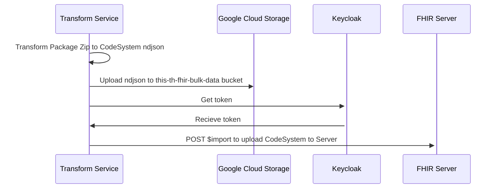

## Install packages
```bash
$ poetry shell
$ poetry install
```

## Run
```bash
python transform-tmlt-to-fhir-format.py
python transform-tmt-to-fhir-format.py
```

## Add dependency
```bash
# Prod lib
$ poetry add <package_name>

# Dev lib
$ poetry add <package_name> --dev
```

## Lint
```bash 
$ poetry run flake8 .
```

## Format
```bash
# Sort import
$ poetry run isort .


# PEP8 Format
$ poetry run black .
```

## Test
```bash
$ poetry run pytest

# Coverage
$ poetry run pytest --cov=.
```

## Security
```bash
# Bandit
$ poetry run bandit -r .

# Safety
$ poetry run safety check
```

## TMT & TMLT Upload flow

